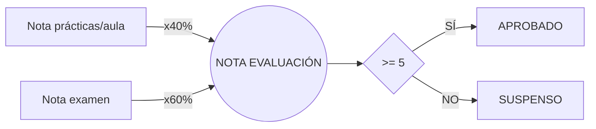

# b1p4

Bloque 1 - Práctica 4 - Repositorio local conectado a remoto en Github desde GUI VSCode
> IES VALLE DEL JERTE PLASENCIA

|          EXAMEN           |  CURSO  |GRUPO |      NOMBRE       |
|:-------------------------:|:-------:|:----:|:-----------------:|
| 1ª Evaluación - 1-12-2022 |2022-2023|1º DAW|Walter Martín Lopes|

### Cálculo de la nota evaluación, sin trabajos voluntarios

