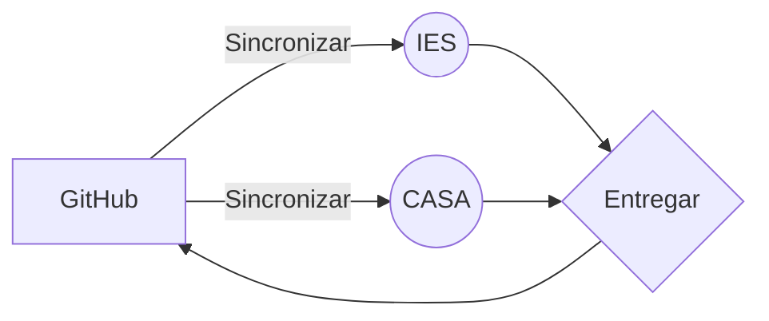

# IES Valle del Jerte - Plasencia
## LMSGI
Esquema resumen entrega de prácticas:

Ejemplo de fórmulas en MartDown:

$$x = \frac {-b \pm \sqrt {b^2 - 4ac}}{2a}$$

*[LMSGI]: Lenguaje de Marcas y Sistemas de Gestión de Información