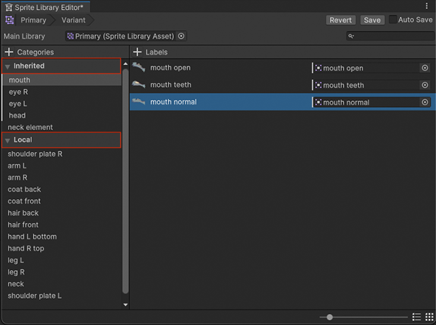
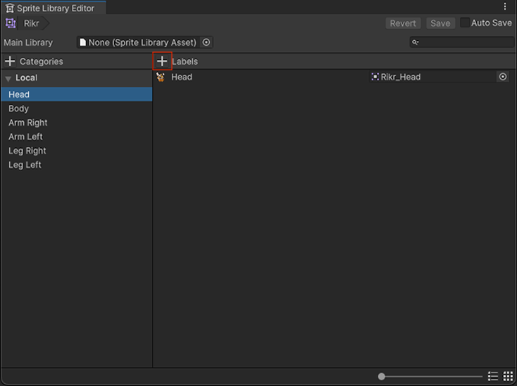
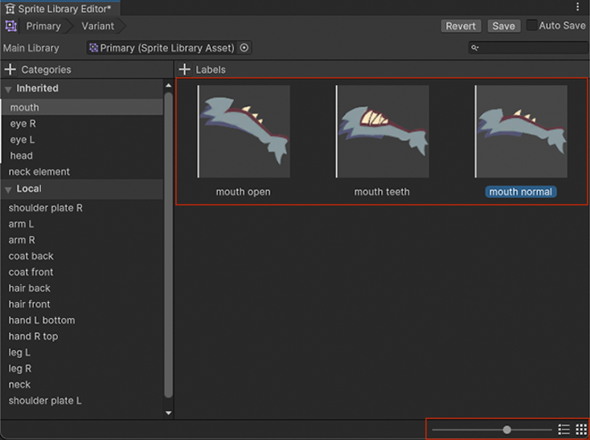

# Sprite Library Editor fundamentals

The Sprite Library Editor window is where you edit the content of a selected [Sprite Library Asset](SL-Asset.md). Select a Sprite Library Asset and then select **Open in Sprite Library Editor** in its Inspector window to open this editor. You can also open the Sprite Library Editor window directly by going to  **Window** > **2D** > **Sprite Library Editor**.

A Sprite Library Asset groups the sprites it contains into [Categories](#categories) and [Labels](#labels), and you edit their contents in the Sprite Library Editor window. This page shows you the [basic features](#useful-editor-features) of the Sprite Library Editor and how to begin editing a Sprite Library Asset.

## Categories

 _Creating a new Category in the Categories column._

Use **Categories** to contain and group **Labels** together for a common purpose to make it easier to organize your sprites. For example, you can create a Category named 'Hat' for Labels which refer to sprites of hats for your character. 

To create a new Category, select **Add (+)** in the Categories column, or [drag](SL-Drag.md) sprites directly into the Sprite Library Editor window. Give each Category a unique name to ensure that the editor correctly identifies each individual Category.

### Local and inherited Categories

 _**Inherited** and **Local** foldout groups in the **Categories** column._

There are two types of Categories:

- **Local**: A Local Category is a Category created in the open Sprite Library Asset in the editor window.
- **Inherited**: An Inherited Category is a Category retrieved from the Sprite Library Asset set as the [Main Library](SL-Editor-UI.md#main-library).

**Note**: You can't rename inherited Categories, to ensure that the Category names in the [Sprite Library Asset Variant](SL-Asset.md#create-a-sprite-library-asset-variant) matches the originals in the Main Library. This ensures that the Variant asset can inherit all Categories and Labels from the Main Library.

To make changes to an inherited Category's content, you can create [overrides](SL-Main-Library.md#create-overrides) to an inherited Category or Label such as adding new Labels or changing the Sprite an inherited Label references instead.

## Labels

A Category contains multiple Labels, with each Label referencing a single sprite in the project. When you are [setting up for Sprite Swap](SpriteSwapSetup.md), Labels with similar functions are commonly placed in the same Category. For example, a Category named 'Hats' may contain Labels which each reference a different hat sprite.

To create a new Label, select **Add (+)** in the Labels column, or [drag](SL-Drag.md) Sprite directly into the Sprite Library Editor window.

_Create a new Label by selecting **Add (+)**._

**Note:** If a Label is inherited from a Main Library and exists in an [inherited Category](#local-and-inherited-categories), you can't rename the inherited Label to ensure that it matches the original's name in the Main Library. This ensures that the Variant asset can inherit all Categories and Labels from the Main Library.

You can create new Labels or edit the sprite reference of an inherited Label as [overrides](SL-Main-Library.md#create-overrides) to an inherited Category or Label. Refer to [Overrides in the Main Library](SL-Main-Library.md) for more information.

## Useful editor features

The following editor features make it more convenient to edit the contents of a Sprite Library Asset. For more information about all available editor features, refer to the [Sprite Library Editor reference](SL-Editor-UI.md).

### Navigate between different assets

When you open a Sprite Library Asset Variant in the Sprite Library Editor, you can use the Sprite Library Editor breadcrumb trail to navigate between different Sprite Library Assets that the opened asset inherits from. Select an asset in the breadcrumb trail to select it in the Project window.

### Toggle between list or grid view

You can view the sprite content of Labels in a list or in a grid. To toggle between these two views, select the respective icon at the lower right of the editor window, and use the slider to adjust the size of the visual preview.

### Filter Categories and Labels by name

Filter the Categories and Labels by entering a text string into the filter bar in the upper right of the window. You can adjust the parameters of the filter by using the [filter context menu](SL-Editor-UI.md#filter-context-menu).

## Additional resources
- [Sprite Library Editor reference](SL-Editor-UI.md)
- [Drag sprites to create or edit Categories and Labels](SL-Drag.md)
- [Overrides to the Main Library](SL-Main-Library.md)