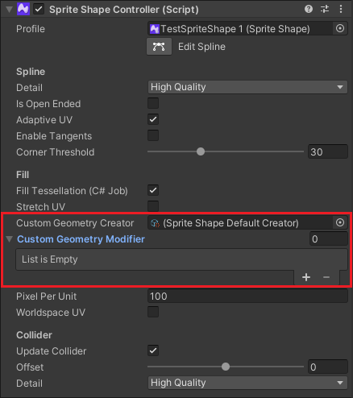

# Generating Custom Geometry

<br/>

The **Custom Geometry** feature is found in the [Sprite Shape Controller](SSController.md). It allows you to use a custom script to generate or modify Sprite Shape geometry. The custom script is written as a [ScriptableObject](https://docs.unity3d.com/Manual/class-ScriptableObject.html) and is reusable.

## API Examples
###Generating new geometry
To generate new geometry, refer to the following example code.

```c#
public abstract class SpriteShapeGeometryCreator : ScriptableObject
{

public abstract int GetVertexArrayCount(SpriteShapeController spriteShapeController);

public abstract JobHandle MakeCreatorJob(SpriteShapeController spriteShapeController, NativeArray<ushort> indices,
    NativeSlice<Vector3> positions, NativeSlice<Vector2> texCoords, NativeSlice<Vector4> tangents,
    NativeArray<SpriteShapeSegment> segments, NativeArray<float2> colliderData);

}
```

**Note:** The default generator script that ships with the Sprite Shape package is itself written as a `SpriteShapeGeometryCreator` (refer to `Runtime/SpriteShapeDefaultCreator.cs`). Any custom `SpriteShapeGeometryCreator` set through the script or Inspector will override this default Object.

###Modifying existing geometry
To modify generated geometry, refer to the following example code.

```c#
public abstract class SpriteShapeGeometryModifier : ScriptableObject
{

    public abstract JobHandle MakeModifierJob(JobHandle generator, SpriteShapeController spriteShapeController, NativeArray<ushort> indices,
        NativeSlice<Vector3> positions, NativeSlice<Vector2> texCoords, NativeSlice<Vector4> tangents,
        NativeArray<SpriteShapeSegment> segments, NativeArray<float2> colliderData);

}
```

**Note:** `SpriteShapeGeometryModifier` is only applicable when either:

1. `SpriteShapeDefaultCreator` is used and the vertex data only needs modification.
2. Or a custom `SpriteShapeGeometryCreator` is used with default channels accepted in `MakeCreatorJob`. `SpriteShapeGeometryModifier` cannot be used when `MakeCreatorJob` creates a Job with custom Channel data.


## Examples by usage
Creating a simple quad with the size of the Bounds with `SpriteShapeGeometryCreator`:

```c#
// A simple C# job to generate a quad.
public struct CreatorJob : IJob
{
    // Indices of the generated triangles.
    public NativeArray<ushort> indices;
    // Vertex positions.
    public NativeSlice<Vector3> positions;
    // Texture Coordinates.
    public NativeSlice<Vector2> texCoords;
    // Sub-meshes of generated geometry.
    public NativeArray<UnityEngine.U2D.SpriteShapeSegment> segments;
    // Input Bounds.
    public Bounds bounds;    

    public void Execute()
    {
        // Generate Positions/TexCoords/Indices for the Quad.
        positions[0] = bounds.min;
        texCoords[0] = Vector2.zero;
        positions[1] = bounds.max;
        texCoords[1] = Vector2.one;
        positions[2] = new Vector3(bounds.min.x, bounds.max.y, 0);
        texCoords[2] = new Vector2(0, 1);
        positions[3] = new Vector3(bounds.max.x, bounds.min.y, 0);
        texCoords[3] = new Vector2(1, 0);
        indices[0] = indices[3] = 0;
        indices[1] = indices[4] = 1;
        indices[2] = 2;
        indices[5] = 3;

        // Set the only sub-mesh (quad)
        var seg = segments[0];
        seg.geomIndex = seg.spriteIndex = 0;
        seg.indexCount = 6;
        seg.vertexCount = 4;
        segments[0] = seg;

        // Reset other sub-meshes.
        seg.geomIndex = seg.indexCount = seg.spriteIndex = seg.vertexCount = 0;
        for (int i = 1; i < segments.Length; ++i)
            segments[i] = seg;        
    }
}

[CreateAssetMenu(fileName = "SpriteShapeQuad", menuName = "ScriptableObjects/SpriteShapeQuad", order = 1)]
public class SpriteShapeQuad : SpriteShapeGeometryCreator
{
    public override int GetVertexArrayCount(SpriteShapeController sc)
    {
        // Set the maximum size required for the Vertices.
        return 64;
    }

    public override JobHandle MakeCreatorJob(SpriteShapeController sc,
        NativeArray<ushort> indices, NativeSlice<Vector3> positions, NativeSlice<Vector2> texCoords,
        NativeSlice<Vector4> tangents, NativeArray<UnityEngine.U2D.SpriteShapeSegment> segments, NativeArray<float2> colliderData)
    {
        NativeArray<Bounds> bounds = sc.spriteShapeRenderer.GetBounds();
        var spline = sc.spline;
        int pointCount = spline.GetPointCount();
        Bounds bds = new Bounds(spline.GetPosition(0), spline.GetPosition(0));
        for (int i = 0; i < pointCount; ++i)
            bds.Encapsulate(spline.GetPosition(i));
        bounds[0] = bds;

        var cj = new CreatorJob()
            {indices = indices, positions = positions, texCoords = texCoords, segments = segments, bounds = bds};
        var jh = cj.Schedule();
        return jh;
    }

}
```


Changing UV data with `SpriteShapeGeometryModifier`:

```c#
// A simple C# job to move the UV along the x-axis. If this is called repeatedly each frame it creates UV Animation effect. To get this called each frame, use RefreshSpriteShape API of SpriteShapeController.
public struct UVAnimatorJob : IJob
{
    // We are only modifying UV data.
    public NativeSlice<Vector2> uvs;
    // Offset to move x coordinates of UV.
    public float offset;

    public void Execute()
    {
        // Move x coordinates of UV data.
        for (int i = 0; i < uvs.Length; ++i)
        {
            var uv = uvs[i];
            uv.x = (uv.x + offset) % 1.0f;
            uvs[i] = uv;
        }
    }
}


[CreateAssetMenu(fileName = "SpriteShapeUVAnimator", menuName = "ScriptableObjects/SpriteShapeUVAnimator", order = 1)]
public class SpriteShapeUVAnimator : SpriteShapeGeometryModifier
{
    public override JobHandle MakeModifierJob(JobHandle generator, SpriteShapeController spriteShapeController, NativeArray<ushort> indices,
        NativeSlice<Vector3> positions, NativeSlice<Vector2> texCoords, NativeSlice<Vector4> tangents, NativeArray<SpriteShapeSegment> segments, NativeArray<float2> colliderData)
    {
        var mj = new UVAnimatorJob(){ uvs = texCoords, offset = UnityEngine.Time.time};
        var jh = mj.Schedule(generator);
        return jh;
    }
}
```


## Advanced usage
The following is an example of advanced usage of the API by creating geometry with vertex colors. In the function `MakeCreatorJob` below, `GetChannels` is invoked to get additional colors other than the default. The input parameters for `MakeCreatorJob` are overwritten by the `GetChannels` function.

 **Note:** Only `SpriteShapeGeometryCreator` can be used when updating any other channels that are not part of the `MakeCreatorJob` parameters.

```c#
public struct ColorCreatorJob : IJob
{
    // Indices of the generated triangles.
    public NativeArray<ushort> indices;
    // Vertex positions.
    public NativeSlice<Vector3> positions;
    // Texture Coordinates.
    public NativeSlice<Vector2> texCoords;
    // Color of Vertces.
    public NativeSlice<Color32> colors;        
    // Sub-meshes of generated geometry.
    public NativeArray<UnityEngine.U2D.SpriteShapeSegment> segments;
    // Input Bounds.
    public Bounds bounds;

    public void Execute()
    {
        // Generate Positions/TexCoords/Indices for the Quad.
        positions[0] = bounds.min;
        texCoords[0] = Vector2.zero;
        colors[0] = Color.red;
        positions[1] = bounds.max;
        texCoords[1] = Vector2.one;
        colors[1] = Color.blue;        
        positions[2] = new Vector3(bounds.min.x, bounds.max.y, 0);
        texCoords[2] = new Vector2(0, 1);
        colors[2] = Color.green;        
        positions[3] = new Vector3(bounds.max.x, bounds.min.y, 0);
        texCoords[3] = new Vector2(1, 0);
        colors[3] = Color.yellow;        
        indices[0] = indices[3] = 0;
        indices[1] = indices[4] = 1;
        indices[2] = 2;
        indices[5] = 3;

        // Set the only sub-mesh (quad)
        var seg = segments[0];
        seg.geomIndex = seg.spriteIndex = 0;
        seg.indexCount = 6;
        seg.vertexCount = 4;
        segments[0] = seg;

        // Reset other sub-meshes.
        seg.geomIndex = seg.indexCount = seg.spriteIndex = seg.vertexCount = 0;
        for (int i = 1; i < segments.Length; ++i)
            segments[i] = seg;  
    }
}

[CreateAssetMenu(fileName = "SpriteShapeColorQuad", menuName = "ScriptableObjects/SpriteShapeColorQuad", order = 1)]
public class SpriteShapeColorQuad : SpriteShapeGeometryCreator
{
    public override int GetVertexArrayCount(SpriteShapeController sc)
    {
        return 64;
    }

    public override JobHandle MakeCreatorJob(SpriteShapeController sc,
        NativeArray<ushort> indices, NativeSlice<Vector3> positions, NativeSlice<Vector2> texCoords,
        NativeSlice<Vector4> tangents, NativeArray<UnityEngine.U2D.SpriteShapeSegment> segments, NativeArray<float2> colliderData)
    {
        NativeArray<Bounds> bounds = sc.spriteShapeRenderer.GetBounds();
        var spline = sc.spline;
        int pointCount = spline.GetPointCount();
        Bounds bds = new Bounds(spline.GetPosition(0), spline.GetPosition(0));
        for (int i = 0; i < pointCount; ++i)
            bds.Encapsulate(spline.GetPosition(i));

        NativeSlice<Color32> colors = default(NativeSlice<Color32>);
        sc.spriteShapeRenderer.GetChannels(32000, out indices, out positions, out texCoords, out colors);

        var cj = new ColorCreatorJob()
            {indices = indices, positions = positions, texCoords = texCoords, colors = colors, segments = segments, bounds = bds};
        var jh = cj.Schedule();
        return jh;
    }

}
```
