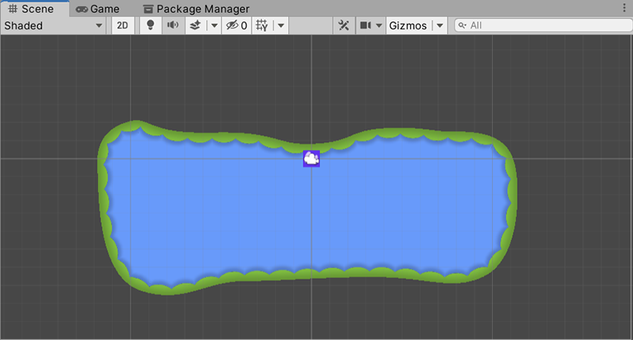
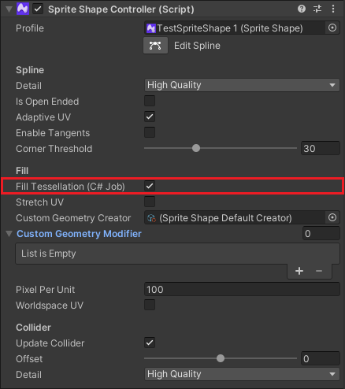

# Fill Tessellation (C# Job)

 Example of a Sprite Shape: the blue area is the inner fill geometry, while the green area is the edge geometry.

The geometry of a Sprite Shape is made up of its outer edge (for both [Open](SSProfile.md#open-shape) and [Closed Shapes](SSProfile.md#closed-shape) and its inner fill (only for Closed Shapes). Both edge and fill geometry are always generated in a [C# Job](https://docs.unity3d.com/Manual/JobSystemOverview.html) which provides performance benefits and avoids potential performance loss from garbage collection (refer to [Understanding Automatic Memory Management](https://docs.unity3d.com/Manual/UnderstandingAutomaticMemoryManagement.html) for more information). Running C# Job also gains additional performance if the [Burst](https://docs.unity3d.com/Packages/com.unity.burst@latest) package is installed in the same Project.

If **Fill Tessellation (C# Job)** is disabled, the fill geometry is generated in the main thread using [LibNess.NET](https://github.com/speps/LibTessDotNet) instead (see [What is multithreading?](https://docs.unity3d.com/Manual/JobSystemMultithreading.html) for more information).

## Requirements
 The **Fill Tessellation (C# Job)** option in the Sprite Shape Controller Inspector window

To enable **Fill Tessellation (C# Job)**, select a Sprite Shape and then select the  **Fill Tessellation (C# Job)** checkbox in its Inspector window; clear the checkbox to disable the feature. The Sprite Shape must also fulfill the following requirements for this feature to work:

1. The Sprite Shape must not have any duplicate points or points that are too close to each other. Duplicate points can occur if you drag a point over another point.
2. The Sprite Shape’s edges cannot intersect or overlap each other.

**Note:** If **Fill Tessellation (C# Job)** is enabled but the Sprite Shape does not fulfill these requirements, then the Sprite Shape’s Fill geometry will not be generated. Disable **Fill Tessellation (C# Job)** to enable the default tessellation method to generate the geometry.

Enabling or disabling this option does not affect the edge geometry tessellation method which is always in a C# Job.

## Recommended tessellation method

The following are examples and reasons for when either method of tessellation is recommended, depending on the requirements of your project.

### When Fill Tessellation (C# Job) is recommended
Enabling **Fill Tessellation (C# Job)** is ideal for situations where you want to reduce memory usage for improved CPU performance. For example, when you have dynamic Sprite Shape objects generated at runtime, or are animating Sprite Shape objects at runtime. Both scenarios feature CPU intensive processes, and enabling **Fill Tessellation (C# Job)** helps to reduce the memory usage of these processes and improve performance overall.

In general, enabling **Fill Tessellation (C# Job)** is also recommended whenever size and memory usage are important constraints to consider for your application or game.

### When default LibTess&#46;NET is recommended
It is recommended to disable the **Fill Tessellation (C# Job)** option and use the default LibTess.NET generation method whenever the Sprite Shape cannot meet the [requirements](#requirements) that allow it to be generated in a C# Job. This could be because the Sprite Shape has a complex spline shape, with overlapping edges or duplicate points. If the Sprite Shape is being generated with non-deterministic and random input points for the shape of its spline, then it is recommended to use LibTess.NET as it is not guaranteed that the Sprite Shape fulfils the Fill Tessellation requirements.

If you enabled **Cache Geometry** under the Sprite Shape Controller properties, then it is recommended that you use LibTess.NET instead of Fill Tessellation. The Sprite Shape’s geometry is cached as it is generated in the Editor, and this stored data is used at runtime instead of being generated at runtime. Both the LibTess.NET and Fill Tessellation options use this stored data instead of recalculating and regenerating the geometry if it is available. As LibTess.NET is more flexible and is able to accept a wider range of inputs when generating the Sprite Shape, it is recommended to disable **Fill Tessellation** if **Cache Geometry** is  used.
