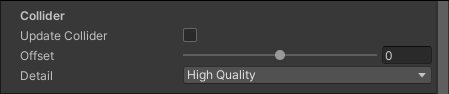

# Enabling Collision
Attach a [Collider 2D](https://docs.unity3d.com/Manual/Collider2D.html) component to your Sprite Shape to enable the Collider properties in the __Sprite Shape Controller__. However, note that only the [Edge](https://docs.unity3d.com/Manual/class-EdgeCollider2D.html) and [Polygon Collider 2D](https://docs.unity3d.com/Manual/class-PolygonCollider2D.html) components can be used with __Sprite Shapes__.

The Collider mesh automatically updates itself to the shape of the Sprite Shape when attached. See the Collider section of the [Sprite Shape Controller](SSController.md) page for more details about the various Sprite Shape Collider options.

## Manually editing the Collider mesh
By default, the Collider mesh is automatically reshaped to match the Sprite Shape every time it is edited. To make manual edits to the Collider mesh directly, disable both __Update Collider__ in the __Sprite Shape Controller's__ Collider settings by clearing their respective checkboxes. This prevents the Sprite Shape Controller from updating the Collider mesh automatically and overriding your manual edits.

