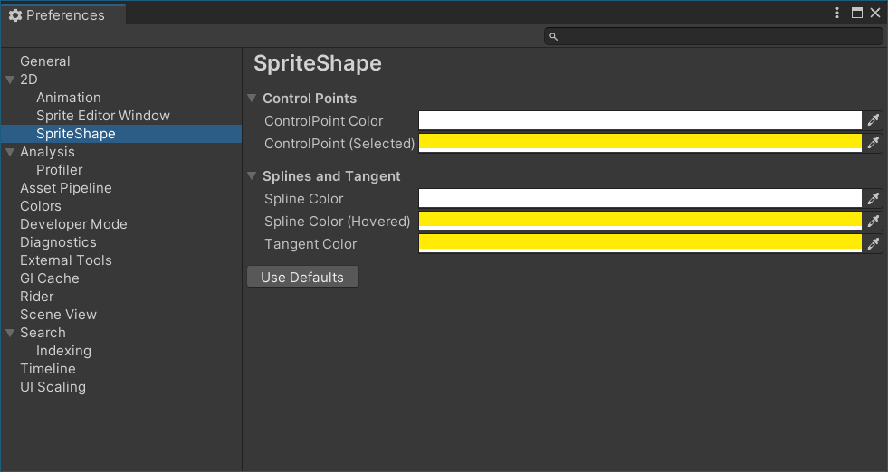

# Sprite Shape Preferences

You can select the colors used by a Sprite Shape's spline and control points through the Sprite Shape Preferences window (menu: **Edit > Preferences > 2D > Sprite Shape**). These colors are displayed when you enable **Edit Spline** in the [Sprite Shape Controller](SSController.md) properties and edit the Sprite Shape.
