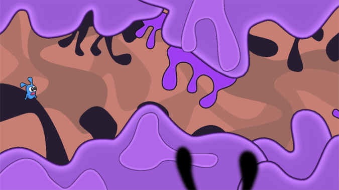
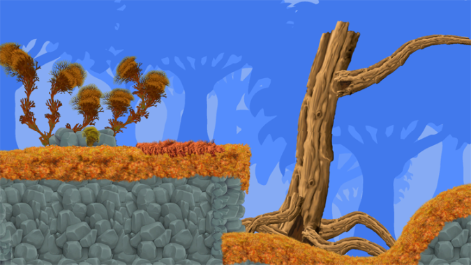
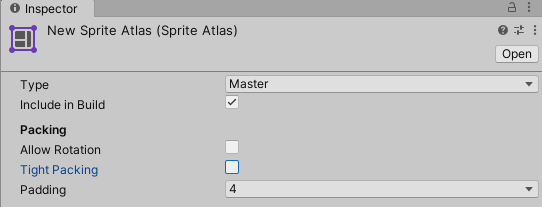

# 2D Sprite Shape

## Overview

The __Sprite Shape__ is a flexible and powerful world building Asset that features Sprite tiling along a shape's outline that automatically deforms and swaps Sprites based on the angle of the outline.  Additionally, you can assign a Fill texture to a Sprite Shape to create filled shapes with tiled textures as backgrounds or other large level-building props.

The following are examples of Sprite Shapes used to construct different parts of various levels.

Sprite Shapes comprise of two parts - the [Sprite Shape Profile](SSProfile.md) Asset, and the [Sprite Shape Controller](SSController.md) component. The Sprite Shape Profile contains the angle settings and Sprites used by the Sprite Shape, and you edit the Sprite Shape's outline with the Sprite Shape Controller component.

## Importing Sprites for Sprite Shapes

When importing Sprites, use the following [property settings](https://docs.unity3d.com/Manual/TextureTypes.html#Sprite) to ensure that the Sprites are compatible for use with Sprite Shape:

1. [Texture Type](https://docs.unity3d.com/Manual/TextureTypes.html#Sprite) - Set this to ‘Sprite (2D and UI)’. Other Texture types are not supported for Sprite Shapes.
2. **Sprite Mode** - Set this to ‘Single’ if the Texture contains only a single Sprite.
3. __Mesh Type__ - This must be set to __Full Rect__ for the Sprite to be used with Sprite Shape.

In addition, if the Sprites used for the Sprite Shape are part of a Sprite Atlas, disable both **Allow Rotation** and **Tight Packing** options under the Sprite Atlas’ properties so that the Sprites can be used by the Sprite Shape.

## Creating a Sprite Shape general workflow

Create __Sprite Shapes__ with the following steps:

1. Create a **Sprite Shape** GameObject from the main GameObject menu (menu: __GameObject > 2D Object > Sprite Shape__) and select from the two available options:
   - [Open Shape](SSProfile.md#open-shape)
   - [Closed Shape](SSProfile.md#closed-shape)
2. Edit the outline of the Sprite Shape with the [Sprite Shape Controller](SSController.md) component settings.
3. Enable [Physics 2D](https://docs.unity3d.com/Manual/class-Physics2DManager.html) interactions for your Sprite Shapes by attaching a [Collider](SSCollision.md) component.

To further customize the shape and outline of a __Sprite Shape__:

1. Create a __Sprite Shape Profile__ from the main menu (menu: __Assets > Create > 2D > Sprite Shape Profile__).
2. Create [Angle Ranges](SSProfile.md#creating-angle-ranges) and [assign Sprites](SSProfile.md#assigning-sprites) in the __Sprite Shape Profile__.
3. Assign the __Sprite Shape Profile__ to a __Sprite Shape Controller__'s __Profile__ settings. The same Profile can be used by multiple Sprite Shapes.
